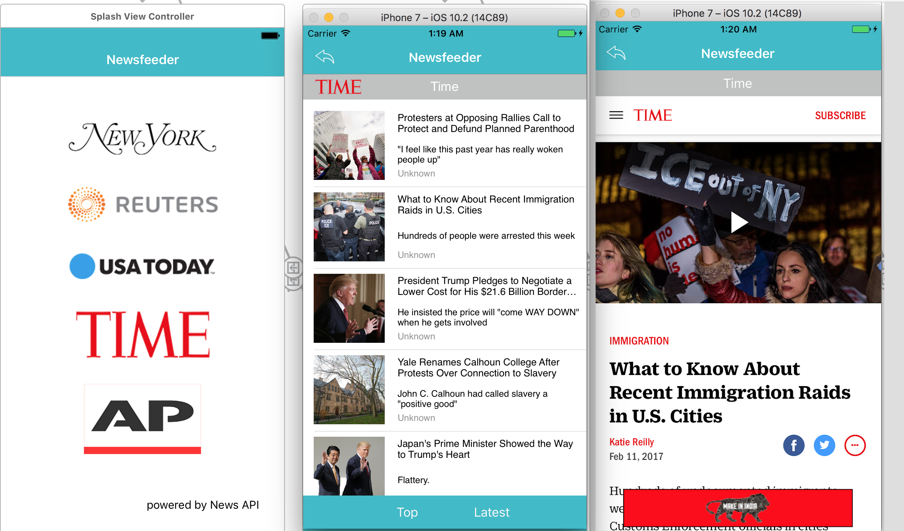

##Project2 Newsfeeder 
NewsFeeder App utilizes [NewsAPI](https://newsapi.org/) for RESTful API to get the news feed from New York Magazine, Reuters, USA Today, Time and Associated Press news agencies.

* Used parameters to toggle through different news agencies to reduce and repeat code for optimization to the App
* Added top and latest tab sorting mechanism using toolbar layout
* Used custom UITableview
* Used both Safariview and Webview to display external information
* Used RESTful API and jSON serialization to obtain data from News API

##Scenario of when Time is Tapped: 

